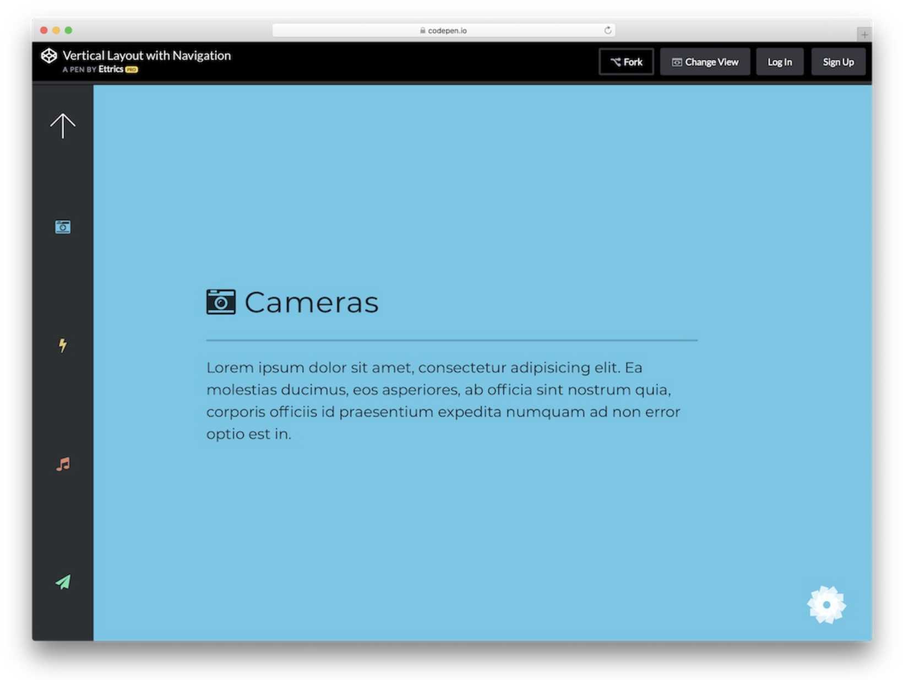
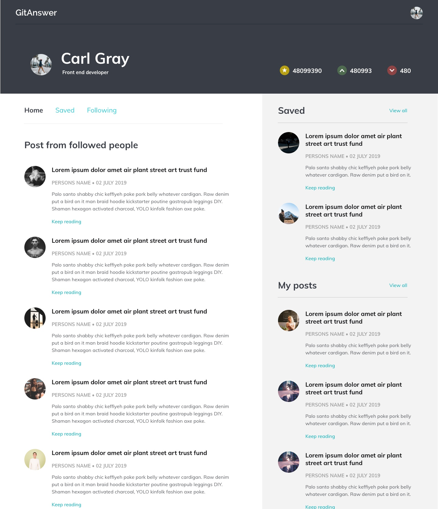

# MERN Stack Project - Git Answer

Final project of CoderAcademy by [Edward Deam](https://github.com/EdwardDeam), [Tony Xu](https://github.com/DesignTX) and [Owen Shepherd](https://github.com/owshepherd)

## Description of libraries used in the app.

TODO: Excellent use of libraries and a complete and detailed description of he libraraies used in the app.

## Provide an overview and description of your source control process.

Our source control was based around the git / github workflow. We created two repositories on GitHub, one for the Node/Express Server and one for the React app. We used multiple feature branches so that individual work wouldn't have an impact on the main working code, and made an effort to make frequent commits so that it was easy to see what changes where made if something went wrong.  
In addition to this we added [Travis CI](https://travis-ci.org/). This utility integrates with GitHub and runs `npm test` on a virtual server. This process is run after a pull request is created. This final check made sure that all tests would still pass with the new code before it was merged.

## Demonstrate sound design architecture

TODO: Shows almost flawless understanding of the high level structure of the app

## Design of ERD

![alt text][erd_diagram]

### Description of symbols used

Sources:
[ER Diagam Symbols and meaning](https://www.lucidchart.com/pages/ER-diagram-symbols-and-meaning)

## Database schema

TODO: Creates a well constructed Database schema that contains methods which meaningfully contribute to the solution.

https://stackoverflow.com/questions/12147686/storing-upvotes-downvotes-in-mongodb
https://stackoverflow.com/questions/11077202/in-mongodb-is-it-practical-to-keep-all-comments-for-a-post-in-one-document
https://docs.mongodb.com/ecosystem/use-cases/storing-comments/

## Dataflow Diagram

TODO: Provides dataflow diagram(s) that strictly follow the standard convensions to clearly identify the processes within your application. Clearly depicts where data is coming from, where it is going and how it is being stored.

## OO Design

TODO: Provides Object Oriented design diagrams(UML or alternative) that clearly identify OO class attributes, methods, relationships.

## Provide UX/UI design documentation(user stories) that adequately show Agile methodology implementation.

TODO: Provides multiple user stories that use ‘persona, what and why’ that outline meaningful features of project. Shows evidence of user story revision and refinement.

**User A**
User A is an aspiring web developer. While studying application creation using the MERN stack, they stumble upon a "trick" which they found makes the process of developing much easier. They are eager to share this trick they have discovered but are unsure where to do this: they could use a programming Q&A website such as Stack Overflow but this may not be a good fit, given the site is used more as a platform to answer questions and not provide tips without prompting. Sites such as Reddit and other programming forums may be more suitable but User A worries there isn't enough exposure to ensure that their tip is seen by enough users to be effective, particularly given that Reddit is home to hundreds of boards for different interests. User A then happens upon GitAnswer. Given that GitAnswer is designed to allow users to post hints straight away without prompting by other users, it is the ideal platform for User A to post his hint. GitAnswer also only deals in programming and/or technology-based hints and tricks, allowing users more opportunity to find hints without trawling through clutter.
User A posts their hint. From there, they are able to receive upvotes and downvotes on their hint as well as comments from other users. User A's hint is able to be viewed by a more code-specific userbase who are simply seeking tips and tricks to make their coding experience easier without having a specific coding question.

**User B**

## Planning Methodology

TODO: Simple and clear standards for planning methodology chosen and adhered to

## Provide UX/UI design documentation(wireframes) that adequately show Agile methodology implementation.

TODO: Provides wireframes that show exceptional planning of project flow and structure including but not limited to space distrobution, content prioritisation, intended actions, functions, relationships between screens.

[Initial Wireframes](questions_src/InitialWireframes.pdf)
[Updated Wireframes](questions_src/UpdatedWireframes.pdf)
[Pavement Colour Scheme](questions_src/Pavement.pdf)

## Demonstrated code flow control

TODO: Flawless code flow control: documented test coverage/successful results for all user stories, including corner cases

## Apply Object oriented principles/patterns

TODO: Superior use of object oriented principles/patterns; use of OO principles/patterns throughout application with positive impact on code maintainability and serviceability

## Employ and utilise proper source control methodology

1. Project files exist on a git repo
2. README and gitignore with appropriate content
3. multiple feature branches with commits from all team members
4. demonstrates frequent commits, merges and pull requests from all team members

## Employ and utilise project management methodology

TODO: Excellent use of task delegation with Kanban board of tickets assigned to team members labelled with difficulty level and corresponding Git commits and demonstrating consideration of strength and weaknesses of team members and project/team conditions.

## Employ and utilise task delegation methodology

Simple and clear standards for planning methodology chosen and adhered to.

## Code Style

TODO: The code adheres to all team standards. The code is exceptionally well organised and very easy to follow. Comments are complete and useful; variables' and functions’ purposes are clearly communicated by their names.

Use a style guide or linter as team.

## Validation of data (including ranges)

TODO: All data is expertly validated using a range of techniques(e.g. regex, etc) and checked; demonstrating an exeptional level of understanding.

## Use of Arrays

TODO: Shows thorough understanding of the use-cases of Arrays and utilises them to solve a problem unsolvable otherwise.

## Use of Objects

TODO: Understands, utilises and manipulates Objects using a range of methods to benefit the solution.

## App functionality

TODO: Builds an outstanding application, that meets client and user needs and exceeds expectations

## Deployment

TODO: Successfully deploys to a cloud hosting service, uses environment variables, use same database type in development/testing as production, uses custom domain name

## User interface

TODO: User-interface is highly intuitive, with no impediments to user flow.

## Testing

### Development testing

TODO: Evidence of extensive user-testing of development site

### Production testing

TODO: Evidence of extensive user-testing of production site, including by client

### Formal testing framework

TODO: Comprehensive test suite including both unit and integration tests in both backend and frontend, with at least 90% code coverage

# Short Answer Questions

## What are the most important aspects of quality software?

TODO: List discusses and demonstrates 6 software quality characteristics.

The software quality characteristic tenets dictate certain needs which need to be met in software (hereafter "product") and should possess the following attributes:

**Capability** _ Can the product perform valuable functions? _

- Complete, containing all the vital functions desired by the end user
- Accurate. In cases where a product performs calculations, the results should be accurate and be presented in the appropriate format.
- Efficient, in that the product performs its actions in a timely manner and does not deviate from its designated function (do what it isn't supposed to).

**Reliability** _ Can you trust the product in many and difficult situations? _

- Stable. To conform to the software quality characteristic of reliability, the product should be stable; not causing crashes, unhandled exceptions, script errors or similiar issues.
- Robust. The product is able to handle errors (both foreseen and unforeseen) without major disruption.
- Able to handle stress, in that the product should cope well or adapt in instances where system limits have been exceeded.

**Usability** _ Is the product easy to use? _

- High affordance. Affordance in this instance refers to the user's ability to explore and discover features of the site; is this easy to do? Does the product allow the user to do this without unnecessary complication?
- Intuitive. Similar to above, the product is easy to follow and understand for end-users. The design falls inline with what is intuitive and what users have come to expect from similar products.
- Minimal. To satisfy this critereon, the product does not contain any redundant features in functionality or design.

**Charisma** _ Does the product have "it"? _

- Unique. Is the product distinguishable from other products and/or promote a feature not found in other products?
- Satisfaction. How does the end-user feel using the product? Is it an enjoyable experience?
- Professional. To fulfill the charisma aspect of the software quality characteristic criteria, a product should feel fit for purpose and have an appropriate air of professionalism.

**Security** _ Does the product protect against unwanted usage? _

- Authentication. Does the product appropriately and securely handle user identification?
- Authorisation, another tenet of the security aspect of the software quality characterics, dictates that a secure product is one where authorisation is used to dictate what the end-user can see and do.
- Privacy. Is the product able to securely house data? A secure product is able to house data and ensures that user or other data cannot be accessed by unauthorised users.

**Performance** _ Is the product fast enough? _

- Capacity. What are the limits of the product? How does the product react in different circumstances (ie. slow network, network issues, etc.)?
- Utilisation of resources. To satisfy this tenet of performance, the product should make appropriate (inexcessive) use of memory, storage, disk space and/or other resources.
- Responsive. The speed an action is performed or is perceived to be performed (ie. delays in the product are not immediately visible or are minimally visible to the end-user).

## A team is about to engage in a project, developing a website for a small business. What knowledge and skills would they need in order to devlop the project?

TODO: Effectively describes a range of skills and knowledge required by IT workers to complete a quality web development project.

## Within your own project what knowledge or skills were required to complete your project, and overcome challenges?

TODO: Effectivlt describes a range of skills and knowledge used to complete a group project.

## Evaluate how effective your knowledge and skills were this project, and suggest changes or improvements for future projects of a similar nature?

TODO: Evaluates effectiveness of knowledge and skills accurately, providing examples, and providing an insightful improvement on each skill.

[erd_diagram]: ./docs/GitAnswerDB.png "Database ERD Diagram"
